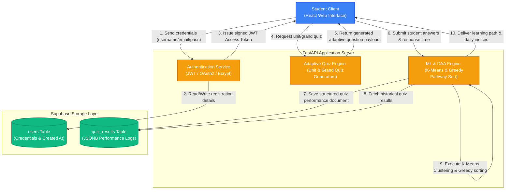

# AI Personalized Learning Platform & Academic Tracker

An advanced academic optimization platform designed to track student performance, analyze learning profiles using Machine Learning, and dynamically generate personalized learning pathways based on historical performance indices.

---

## 📊 Data Flow Diagram (DFD)

The diagram below details the data interactions between the Client Browser, the FastAPI Backend components, and the Supabase PostgreSQL database.

---

## 🎯 Project Objectives

Through its modular design, the platform achieves four core objectives. Below is the technical breakdown of how each is implemented:

### Objective 1: Dynamic Learner Profiling
**Goal**: Classify students dynamically into profile groups (`Slow Learner`, `Average Learner`, and `Quick Learner`) based on their historical accuracy and response speed.

*   **Mathematical Modeling**:
    The platform calculates a composite **Performance Score** ($P_u$) for each user ($u$):
    $$P_u = 0.7 \cdot A_u + 0.3 \cdot (S_u - 1)$$
    Where:
    *   **Accuracy** ($A_u$) is defined as:
        $$A_u = \frac{\text{Correct Answers}}{\text{Total Questions}}$$
    *   **Speed Score** ($S_u$) is scaled relative to an ideal response time of 45 seconds per question:
        $$S_u = \min\left(1.5, \frac{45}{\text{Time per Question}}\right)$$
*   **Algorithm (K-Means Clustering)**:
    Using `scikit-learn`'s unsupervised **K-Means Clustering** algorithm with $K = 3$ clusters, the engine clusters the calculated $P_u$ metrics of all users. The cluster centers are sorted to assign labels:
    $$\text{Sorted Clusters: } C_0 < C_1 < C_2$$
    *   $C_0 \rightarrow$ **Slow Learner**
    *   $C_1 \rightarrow$ **Average Learner**
    *   $C_2 \rightarrow$ **Quick Learner**

---

### Objective 2: Personalized Learning Pathway Generation
**Goal**: Construct a structured, hierarchical remedial study plan highlighting weak syllabus subtopics.

*   **Mathematical Modeling**:
    For every subtopic ($s$) in topic ($t$) within a syllabus unit ($U$), the engine computes the student's **Error Rate** ($ER_s$):
    $$ER_s = 1 - \frac{\text{Correct Answers}_s}{\text{Total Questions}_s}$$
    Priority is classified dynamically:
    $$\text{Priority}(s) = \begin{cases} 
      \text{High-Priority} & \text{if } ER_s \ge 0.5 \\
      \text{Needs Review} & \text{if } 0 < ER_s < 0.5 
    \end{cases}$$
*   **Algorithm (Greedy Categorization)**:
    The DAA engine sequentially processes historical records to map performance. It builds a nested hierarchy:
    $$\text{Unit } \rightarrow \text{Topic } \rightarrow \text{Subtopics (filtered by priority)}$$
    This allows students to focus immediately on high-priority subtopics before progressing.

---

### Objective 3: Real-Time Performance & Efficiency Index Tracking
**Goal**: Calculate daily analytical indices showing the student's learning progression over time.

*   **Mathematical Modeling**:
    For each active day, the system computes the running averages of:
    *   **Accuracy Index** ($AI_d$):
        $$AI_d = \left( \frac{\sum \text{Score obtained}}{\sum \text{Max score possible}} \right) \times 100$$
    *   **Efficiency Index** ($EI_d$):
        $$EI_d = AI_d \times \left( \frac{45.0 \text{ seconds}}{\text{Avg. Time per Question}} \right) \times 100$$

---

### Objective 4: Adaptive Quiz Generation
**Goal**: Generate unit-wise and grand quizzes matching the syllabus structure and target difficulty configurations.

*   **Implementation**:
    The system reads template schemas and structures quizzes dynamically based on the student's profile, selecting questions corresponding to the required difficulty parameters.

---

## 🛠️ Specialized Tools and Libraries Used

To keep the platform optimized, the application avoids heavy data science tools like Pandas, instead utilizing targeted libraries:

*   **`psycopg2-binary`**: Direct database connector for low-latency PostgreSQL communication.
*   **`scikit-learn`**: Utilized exclusively for running unsupervised `KMeans` clustering models.
*   **`python-jose[cryptography]`**: Provides JSON Web Token (JWT) signatures and token decoding.
*   **`passlib[bcrypt]`**: Secure password hashing algorithms using salted Bcrypt values.
*   **`pydantic`**: Fast schema validation and serialization for API requests and responses.
*   **`chart.js` & `react-chartjs-2`**: Client-side library to render accuracy and efficiency indices.
